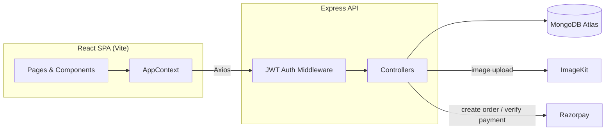

# 🚗 CarRental

A full-stack car rental platform where customers can search, book and pay for cars online, and owners can list their own cars and manage bookings through a dedicated dashboard.

**Live demo:** [rentyourdreamcar.vercel.app](https://rentyourdreamcar.vercel.app)

---

## Table of Contents

- [Features](#features)
- [Tech Stack](#tech-stack)
- [Project Structure](#project-structure)
- [Architecture](#architecture)
- [Getting Started](#getting-started)
- [Environment Variables](#environment-variables)
- [API Reference](#api-reference)
- [Deployment](#deployment)
- [Roadmap](#roadmap)
- [Author](#author)

---

## Features

### Customer
- Browse and search available cars by **location, pickup date and return date**
- View detailed car specs (brand, model, year, category, fuel type, transmission, seating capacity, price/day)
- Real-time availability check that excludes cars with overlapping bookings
- Secure online payment via **Razorpay**
- Track all bookings and their status (pending / confirmed / cancelled) in **My Bookings**
- Built-in FAQ **chat assistant** for availability, pricing, locations, documents and cancellation queries
- Light/Dark theme support

### Owner
- Dedicated **Owner Dashboard** with total cars, total bookings, pending/completed bookings and monthly revenue
- Add a new car listing with image upload (auto-optimized via ImageKit)
- Manage listed cars — toggle availability or remove a car
- Manage incoming bookings and update their status
- Update profile picture

### Platform
- JWT-based authentication with role-based access control (`user` / `owner`)
- Password hashing with bcrypt
- Image upload & on-the-fly optimization (resize, compress, WebP conversion) via ImageKit
- Payment order creation + signature verification via Razorpay

---

## Tech Stack

**Frontend**
- [React 19](https://react.dev/) + [React Router 7](https://reactrouter.com/)
- [Vite](https://vitejs.dev/) — build tool & dev server
- [Tailwind CSS 4](https://tailwindcss.com/) — styling
- [Motion](https://motion.dev/) (Framer Motion) — animations
- [Axios](https://axios-http.com/) — HTTP client
- [React Hot Toast](https://react-hot-toast.com/) — notifications
- TypeScript tooling (`tsc`) + [oxlint](https://oxc.rs/) for linting

**Backend**
- [Node.js](https://nodejs.org/) + [Express 5](https://expressjs.com/)
- [MongoDB](https://www.mongodb.com/) + [Mongoose](https://mongoosejs.com/)
- [JWT](https://jwt.io/) (`jsonwebtoken`) — authentication
- [bcrypt](https://www.npmjs.com/package/bcrypt) — password hashing
- [Multer](https://www.npmjs.com/package/multer) — multipart/form-data (file) handling
- [ImageKit](https://imagekit.io/) — image storage & optimization
- [Razorpay](https://razorpay.com/) — payment gateway

**Deployment**
- [Vercel](https://vercel.com/) (both client and server, configured via `vercel.json`)

---

## Project Structure

```
CarRental/
├── client/                      # React frontend (Vite)
│   ├── src/
│   │   ├── assets/              # Images, icons, static data
│   │   ├── components/          # Reusable UI components (Navbar, Hero, Login, Chatbot, ...)
│   │   │   └── owner/           # Owner-specific components (Sidebar, NavbarOwner, ...)
│   │   ├── context/              # AppContext — global state (auth, theme, cars, currency)
│   │   ├── pages/                # Route-level pages (Home, Cars, CarDetails, MyBookings, ...)
│   │   │   └── owner/            # Owner dashboard pages (Dashboard, AddCar, ManageCars, ManageBooking)
│   │   ├── App.jsx               # Route definitions
│   │   └── main.jsx              # App entry point
│   └── vercel.json               # SPA rewrite config for Vercel
│
├── server/                      # Express backend
│   ├── configs/                  # DB, ImageKit and Razorpay client setup
│   ├── controllers/              # Route handlers (user, owner, booking)
│   ├── middleware/                # JWT auth guard, multer upload config
│   ├── models/                   # Mongoose schemas (User, Car, Booking)
│   ├── routes/                    # Express routers
│   ├── server.js                  # App entry point
│   └── vercel.json                 # Serverless deployment config
│
└── package.json                  # Root convenience scripts
```

---

## Architecture



**Request flow:** the client attaches a `Bearer` JWT to authenticated requests → `protect` middleware verifies the token and loads the user → role-aware controllers read/write MongoDB, and delegate file uploads to ImageKit and payments to Razorpay.

---

## Getting Started

### Prerequisites
- [Node.js](https://nodejs.org/) v18+
- A [MongoDB](https://www.mongodb.com/atlas) database (Atlas or local)
- [ImageKit](https://imagekit.io/) account (for image uploads)
- [Razorpay](https://razorpay.com/) account (for payments)

### 1. Clone the repository
```bash
git clone https://github.com/<your-username>/CarRental.git
cd CarRental
```

### 2. Backend setup
```bash
cd server
npm install
```
Create a `.env` file inside `server/` (see [Environment Variables](#environment-variables)), then run:
```bash
npm run server   # starts with nodemon (auto-reload)
# or
npm start        # plain node
```
The API runs on `http://localhost:4000` by default.

### 3. Frontend setup
```bash
cd client
npm install
```
Create a `.env` file inside `client/` (see [Environment Variables](#environment-variables)), then run:
```bash
npm run dev
```
The app runs on `http://localhost:5173` by default.

> From the project root, `npm run dev` (root `package.json`) also starts the client directly.

---

## Environment Variables

### `server/.env`
| Variable | Description |
|---|---|
| `MONGODB_URI` | MongoDB connection string |
| `JWT_SECRET` | Secret used to sign/verify JWTs |
| `IMAGEKIT_PUBLIC_KEY` | ImageKit public API key |
| `IMAGEKIT_PRIVATE_KEY` | ImageKit private API key |
| `IMAGEKIT_URL_ENDPOINT` | ImageKit URL endpoint |
| `RAZORPAY_KEY_ID` | Razorpay key ID |
| `RAZORPAY_KEY_SECRET` | Razorpay key secret |
| `PORT` | *(optional)* server port, defaults to `4000` |

### `client/.env`
| Variable | Description |
|---|---|
| `VITE_BASE_URL` | Base URL of the backend API (e.g. `http://localhost:4000`) |
| `VITE_CURRENCY` | Currency symbol used across the UI (e.g. `₹`) |
| `VITE_RAZORPAY_KEY_ID` | Razorpay public key ID (used to open the checkout widget) |

> ⚠️ **Never commit real `.env` files.** Both are already git-ignored — use `.env.example` files with placeholder values if you want to document them for collaborators, and rotate any credentials that may have been exposed previously.

---

## API Reference

Base URL: `/api`

### Auth & Users — `/api/user`
| Method | Endpoint | Auth | Description |
|---|---|---|---|
| POST | `/register` | Public | Register a new user or owner |
| POST | `/login` | Public | Log in and receive a JWT |
| GET | `/data` | Required | Get the logged-in user's profile |
| GET | `/cars` | Public | List all currently available cars |

### Owner — `/api/owner`
| Method | Endpoint | Auth | Description |
|---|---|---|---|
| POST | `/add-car` | Owner | Add a new car (multipart: `carData` + `image`) |
| GET | `/cars` | Owner | List cars owned by the logged-in owner |
| POST | `/toggle-car` | Owner | Toggle a car's availability |
| POST | `/delete-car` | Owner | Remove a car listing |
| GET | `/dashboard` | Owner | Get dashboard stats (cars, bookings, revenue) |
| POST | `/update-image` | Required | Update profile picture |

### Bookings — `/api/bookings`
| Method | Endpoint | Auth | Description |
|---|---|---|---|
| POST | `/check-availability` | Public | Check car availability for a location/date range |
| POST | `/create` | Required | Create a Razorpay order for a booking |
| POST | `/verify-payment` | Required | Verify payment signature and confirm the booking |
| GET | `/user` | Required | List the logged-in user's bookings |
| GET | `/owner` | Owner | List bookings for the logged-in owner's cars |
| POST | `/change-status` | Owner | Update a booking's status |

> Protected routes require an `Authorization: Bearer <token>` header.

---

## Deployment

Both apps are configured for **Vercel**:

- **Client** (`client/vercel.json`) — deployed as a static SPA with a catch-all rewrite to `index.html` so client-side routing works on refresh.
- **Server** (`server/vercel.json`) — deployed as a Node.js serverless function via `@vercel/node`, with all routes proxied to `server.js`.

Steps:
1. Deploy `server/` as a separate Vercel project and add all backend environment variables in the Vercel dashboard.
2. Deploy `client/` as a separate Vercel project, setting `VITE_BASE_URL` to the deployed server's URL.
3. Update the `cors` origin list in [server.js](server/server.js) to include your deployed client URL.

---

## Roadmap

Things worth tightening up before treating this as a hardened production system:

- [ ] Add server-side request validation (e.g. `zod`/`joi`) instead of manual field checks
- [ ] Add automated tests (unit + API integration) and a CI pipeline
- [ ] Add rate limiting / helmet-style security headers on the API
- [ ] Replace the rule-based chat widget with a real support channel or LLM-backed assistant if needed at scale
- [ ] Add pagination for car listings and bookings

---

## Author

**Himanshu Kumar**
Built as a full-stack MERN car rental platform with real payment and image-upload integrations.
